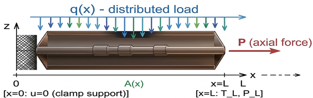
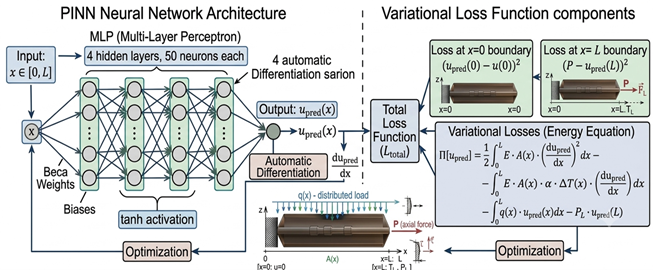
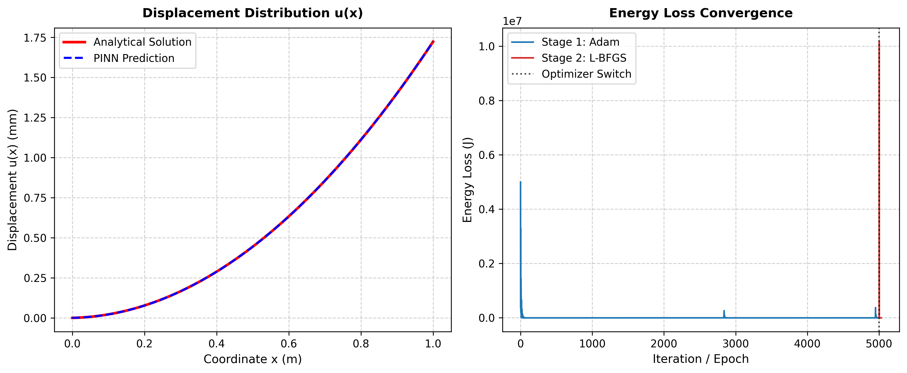

# Physics-Informed Neural Network (Deep Ritz Method) for Thermoelasticity Analysis

## Overview

This repository contains the implementation and numerical results of a Physics-Informed Neural Network (PINN) based on the Deep Ritz method for the thermoelastic analysis of rods with variable cross-section.

The proposed approach combines the principles of continuum mechanics, thermoelasticity, variational formulation, and deep neural networks to obtain numerical solutions without relying on conventional mesh-based discretization.

The model considers a thermoelastic rod subjected to mechanical and thermal loading, distributed forces, and appropriate boundary conditions.

---

## Problem Formulation

The considered problem describes the thermoelastic response of a rod with a variable cross-sectional area:

$$
A = A(x)
$$

where $x$ is the longitudinal coordinate and $A(x)$ represents the variable cross-sectional area.

The total strain is represented as:

$$
\varepsilon(x)
=
\frac{du(x)}{dx}
$$

The thermoelastic strain is:

$$
\varepsilon_{\mathrm{th}}(x)
=
\alpha(x)\Delta T(x)
$$

where:

- $u(x)$ is the axial displacement;
- $\alpha(x)$ is the coefficient of thermal expansion;
- $\Delta T(x)$ is the temperature change.

The elastic strain is defined as:

$$
\varepsilon_{\mathrm{el}}(x)
=
\frac{du(x)}{dx}
-
\alpha(x)\Delta T(x)
$$

The corresponding stress is calculated using the thermoelastic constitutive relation:

$$
\sigma(x)
=
E(x)
\left[
\frac{du(x)}{dx}
-
\alpha(x)\Delta T(x)
\right]
$$

where $E(x)$ is Young's modulus.

The axial force is given by:

$$
P(x)=\sigma(x)A(x)
$$

---

## Physical Model

The considered thermoelastic rod is subjected to distributed mechanical and thermal loading.

### Figure 1. Rod schematic and boundary conditions



The schematic illustrates the variable cross-section rod, distributed loading, thermal loading, and the corresponding mechanical boundary conditions.

The rod is considered within the domain:

$$
0 \leq x \leq L
$$

where $L$ is the rod length.

At the clamped boundary, the displacement condition is:

$$
u(0)=0
$$

The opposite boundary is subjected to the corresponding mechanical boundary condition.

---

## Thermoelastic Mathematical Model

The mathematical formulation is based on the thermoelastic constitutive law and the Bernoulli-Euler hypothesis.

### Figure 2. Thermoelastic model


The model describes the relationship between displacement, strain, stress, temperature variation, material properties, and cross-sectional area.

For a thermoelastic rod, the stress-strain relationship is expressed as:

$$
\sigma(x)
=
E(x)
\left[
\varepsilon(x)
-
\alpha(x)\Delta T(x)
\right]
$$

Substituting the axial strain gives:

$$
\sigma(x)
=
E(x)
\left[
\frac{du(x)}{dx}
-
\alpha(x)\Delta T(x)
\right]
$$

The corresponding axial force is:

$$
P(x)
=
A(x)E(x)
\left[
\frac{du(x)}{dx}
-
\alpha(x)\Delta T(x)
\right]
$$

---

## Physics-Informed Neural Network

The displacement field is approximated using a neural network:

$$
u(x) \approx u_{\mathrm{pred}}(x)
$$

The neural network takes the spatial coordinate $x$ as input and predicts the axial displacement.

The derivative of the predicted displacement is obtained using automatic differentiation:

$$
\frac{du_{\mathrm{pred}}}{dx}
$$

The predicted thermoelastic strain is therefore:

$$
\varepsilon_{\mathrm{pred}}(x)
=
\frac{du_{\mathrm{pred}}(x)}{dx}
-
\alpha(x)\Delta T(x)
$$

The predicted stress is:

$$
\sigma_{\mathrm{pred}}(x)
=
E(x)
\left[
\frac{du_{\mathrm{pred}}(x)}{dx}
-
\alpha(x)\Delta T(x)
\right]
$$

The physical constraints of the thermoelastic problem are incorporated into the variational loss function.

### Figure 3. PINN architecture



The neural network consists of multiple fully connected layers. The architecture uses nonlinear activation functions and automatic differentiation to construct the variational formulation of the thermoelastic problem.

---

## Deep Ritz Variational Formulation

The Deep Ritz method is used to minimize the total potential energy of the system.

The variational formulation incorporates:

- elastic strain energy;
- thermal energy contribution;
- distributed mechanical loading;
- boundary conditions;
- axial forces at the rod boundaries.

The elastic energy contribution can be represented as:

$$
\Pi_{\mathrm{elastic}}
=
\frac{1}{2}
\int_0^L
E(x)A(x)
\left[
\frac{du}{dx}
-
\alpha(x)\Delta T(x)
\right]^2
dx
$$

The contribution of the distributed load is represented by:

$$
\Pi_{\mathrm{load}}
=
-
\int_0^L
q(x)u(x)\,dx
$$

where $q(x)$ is the distributed mechanical load.

The boundary contribution associated with the axial force is:

$$
\Pi_{\mathrm{boundary}}
=
-
P_Lu(L)
$$

The total variational functional is therefore represented in general form as:

$$
\Pi[u]
=
\Pi_{\mathrm{elastic}}
+
\Pi_{\mathrm{load}}
+
\Pi_{\mathrm{boundary}}
$$

The neural network parameters are optimized by minimizing this functional:

$$
\theta^*
=
\operatorname*{arg\,min}_{\theta}
\Pi[u_{\theta}]
$$

where $\theta$ represents the trainable neural network parameters.

---

## Boundary Conditions

The model incorporates the mechanical boundary conditions into the variational formulation.

At the clamped boundary:

$$
u(0)=0
$$

At the loaded boundary:

$$
P(L)=\sigma(L)A(L)
$$

The corresponding boundary force is incorporated into the total loss function.

The boundary conditions ensure that the neural network solution satisfies the physical constraints of the thermoelastic rod.

---

## Numerical Results

The trained PINN model is evaluated by comparing its predictions with the corresponding reference solution.

### Figure 4. PINN numerical results



The results demonstrate the ability of the proposed Physics-Informed Neural Network to reproduce the thermoelastic response of the variable-section rod.

The numerical solution can be analyzed in terms of:

- axial displacement;
- stress distribution;
- strain distribution;
- influence of variable cross-section;
- influence of thermal loading;
- agreement between PINN and reference solutions.

---

## Computational Workflow

The computational workflow consists of the following steps:

1. Definition of the thermoelastic rod geometry.
2. Definition of the variable cross-sectional area $A(x)$.
3. Specification of material properties.
4. Definition of mechanical loading.
5. Definition of thermal loading.
6. Definition of boundary conditions.
7. Construction of the neural network.
8. Calculation of displacement derivatives using automatic differentiation.
9. Construction of the variational energy functional.
10. Construction of the total loss function.
11. Optimization of the neural network parameters.
12. Evaluation of the predicted thermoelastic response.
13. Comparison with the reference numerical solution.
14. Visualization of the obtained results.

---

## Source Code

The main implementation is provided in Python.

### Main Python file

[pinn_variable_section_rod.py](pinn_variable_section_rod.py)

The script contains the implementation of the PINN/Deep Ritz approach for the thermoelastic rod with variable cross-section.

---

## Repository Structure

```text
pinn-thermoelasticity-rods/
│
├── README.md
├── .gitignore
│
├── rod_schematic_Fig1.png.png
├── thermoelastic_model_Fig2.png
├── pinn_architecture.png_Fig.3.png
├── pinn_results_en.png
│
└── pinn_variable_section_rod.py
