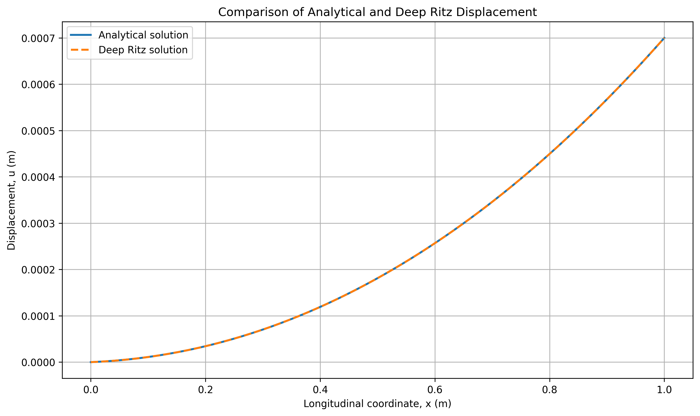
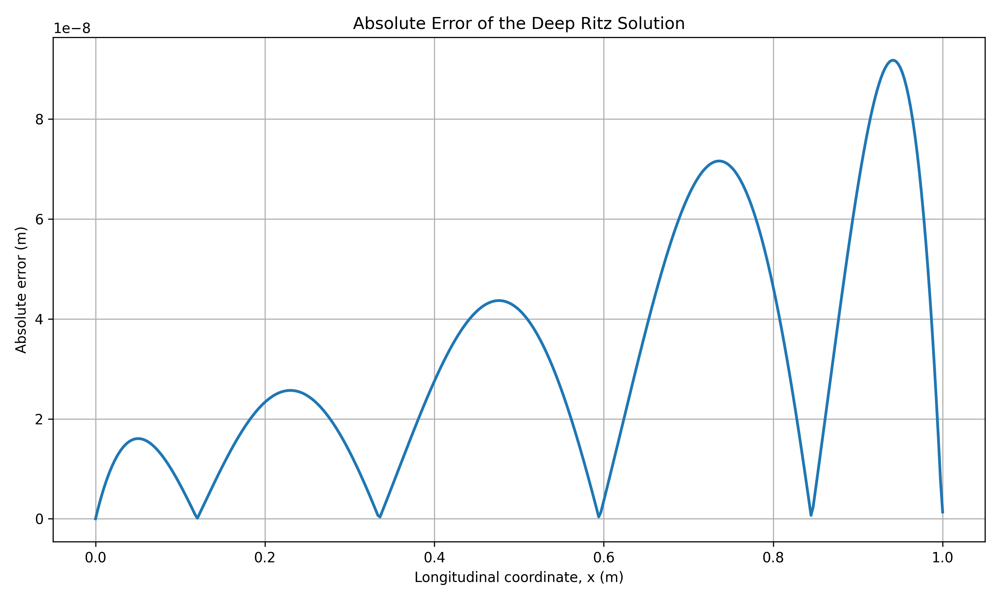
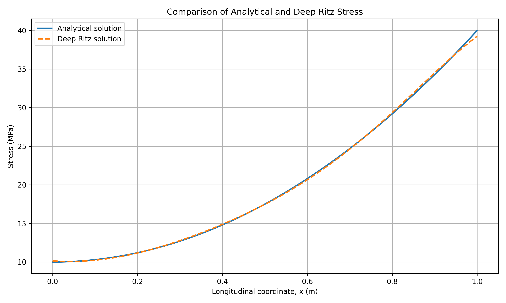
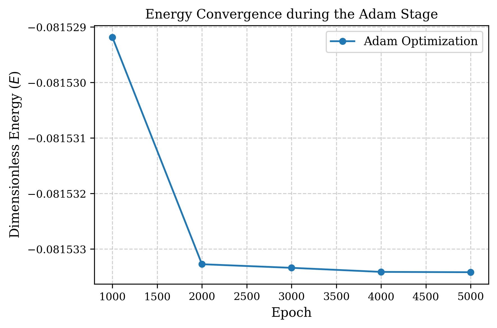

# Manuscript Figures

| Файл | Описание (на английском) | Описание (на русском) |
| :--- | :--- | :--- |
| `Figure_1_displacement_comparison.png` | Comparison of analytical and Deep Ritz displacement distribution | Сравнение аналитического и Deep Ritz распределения перемещений |
| `Figure_2_absolute_error.png` | Spatial distribution of the absolute displacement error | Пространственное распределение абсолютной ошибки перемещения |
| `Figure_3_stress_comparison.png` | Comparison of analytical and Deep Ritz axial stress distribution | Сравнение аналитического и Deep Ritz распределения осевых напряжений |
| `Figure_4_Adam.png` | Convergence of the dimensionless variational energy | Сходимость безразмерной вариационной энергии |
| `Figure_5_temperature_distribution.png` | Temperature distribution along the rod | Распределение температуры вдоль стержня |

## Визуальный предварительный просмотр

**Рисунок 1**

**Рисунок 2**

**Рисунок 3**

**Рисунок 4**

**Рисунок 5**

